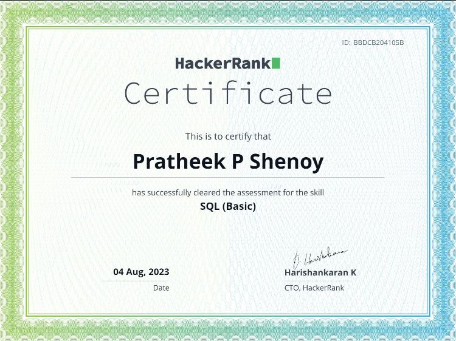
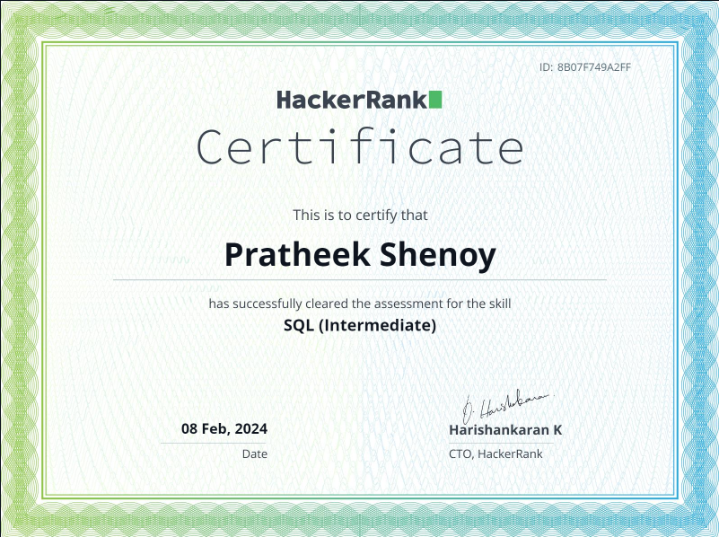
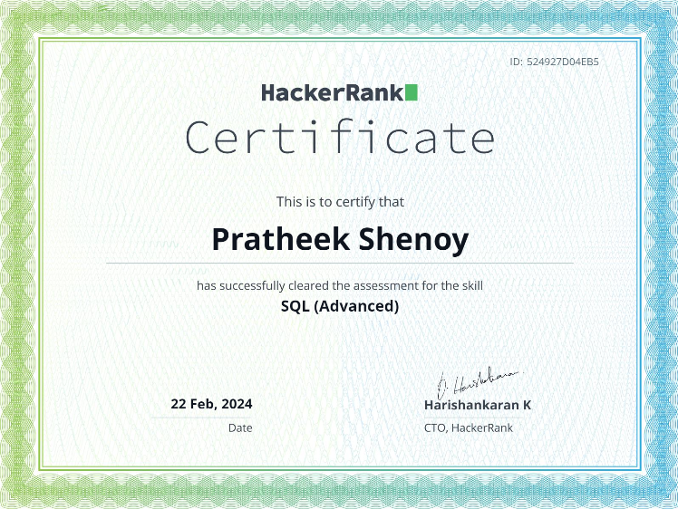

# HackerRank SQL Skills Certificates

This folder contains my HackerRank SQL skills certificates. These certificates signify my proficiency in SQL at various levels.

## Certificates

1. **SQL Basic Certificate**

   - [Certificate Link](https://www.hackerrank.com/certificates/bbdcb204105b)

2. **SQL Intermediate Certificate**

   - [Certificate Link](https://www.hackerrank.com/certificates/8b07f749a2ff)

3. **SQL Advanced Certificate**

   - [Certificate Link](https://www.hackerrank.com/certificates/524927d04eb5)

## About HackerRank

HackerRank is a platform that provides coding challenges and skill assessments for developers. Their SQL domain offers a range of challenges to test and improve SQL skills.

## How to Verify Certificates

You can verify the authenticity of these certificates by visiting the respective links provided above.

## Additional Information

For further information about HackerRank and their certification programs, visit [HackerRank's website](https://www.hackerrank.com/skills-verification).

